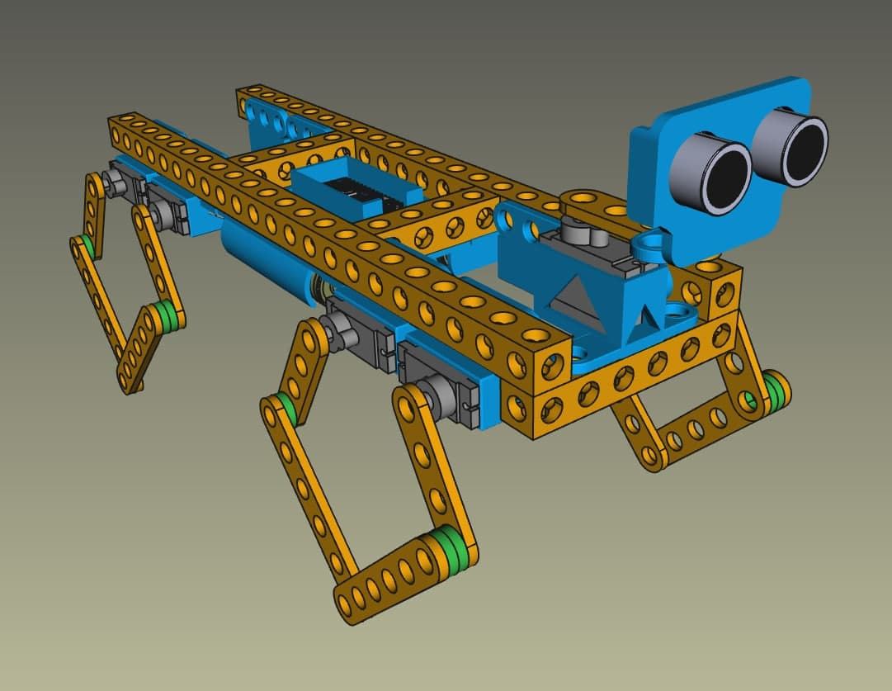
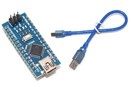

# GuepardBot
STEMFIE adaptation to Baby MIT Cheetah 

Iniciat per [Artur Binefa] de enginy 3D amb Freecad, i realitzat per [Jordi Mayné](https://github.com/maynej) des de Mechatronic Study 

Stemfie es un projecte de construcció lliure, que s'imprimeix en 3D (http://stemfie.org) 

Tota la [documentació es pot trobar en PDF](https://github.com/maynej/GuepardBot/tree/main/DOC).

STL per imprimir (https://github.com/maynej/GuepardBot/tree/main/STL).

## Suports 3D
  
Descripció         | Imatge          | Arxiu         
------------- | ------------- | ------------- 
Suport Arduino Nano i tapa | | [Arduino Nano](CPU/ArduinoNanoStemfie.stl), [Tapa Arduino Nano](CPU/TapaArduinoNanoStemfie.stl)
Suport Bateria Li-ion 18650| | [18650](CPU/18650Holder2Stemfie.stl)
Suport Servo-motor SG9| | [ServoSuport 3H](ServoMount/ServoSuport3HStemfie.stl), [ServoSuport 3V](ServoMount/ServoSuport3VStemfie.stl), [ServoSuport 5H](ServoMount/ServoSuport5HStemfie.stl), [ServoSuport 3mig](ServoMount/ServoSuport4migStemfie.stl)
Suport palanca Servo-motor SG9| |[Adapter SG9](ServoMount/Servo9GAdapter_Stemfie.stl)
Suport Sensor HC-SR04| |[HC-SR04 Asimetric 3H](SensorsMount/SensorAsimetric3H_Stemfie.stl), [HC-SR04 Asimetric 3V](SensorsMount/SensorAsimetric3Stemfie.stl), [HC-SR04 Asimetric 4V](SensorsMount/SensorAsimetric4Stemfie.stl)   

## Llicència

Attribution-ShareAlike 4.0 International (CC BY-SA 4.0)
